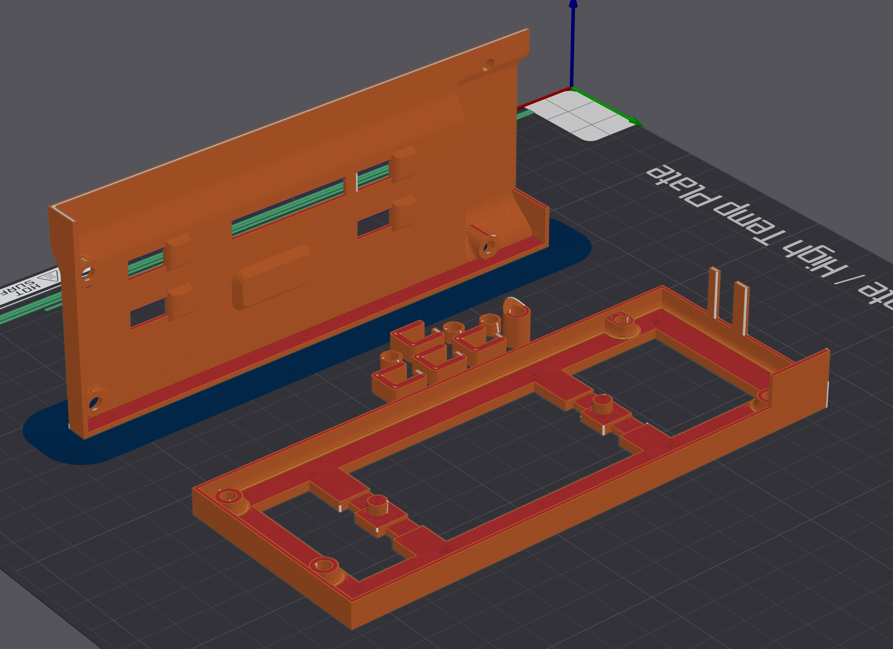
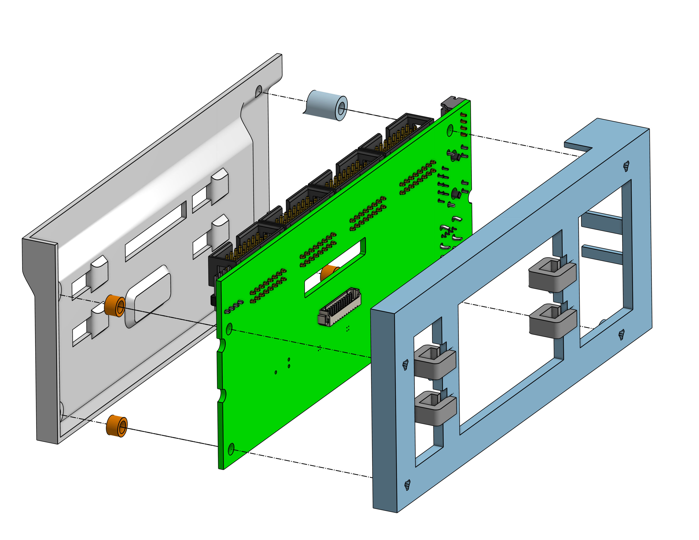
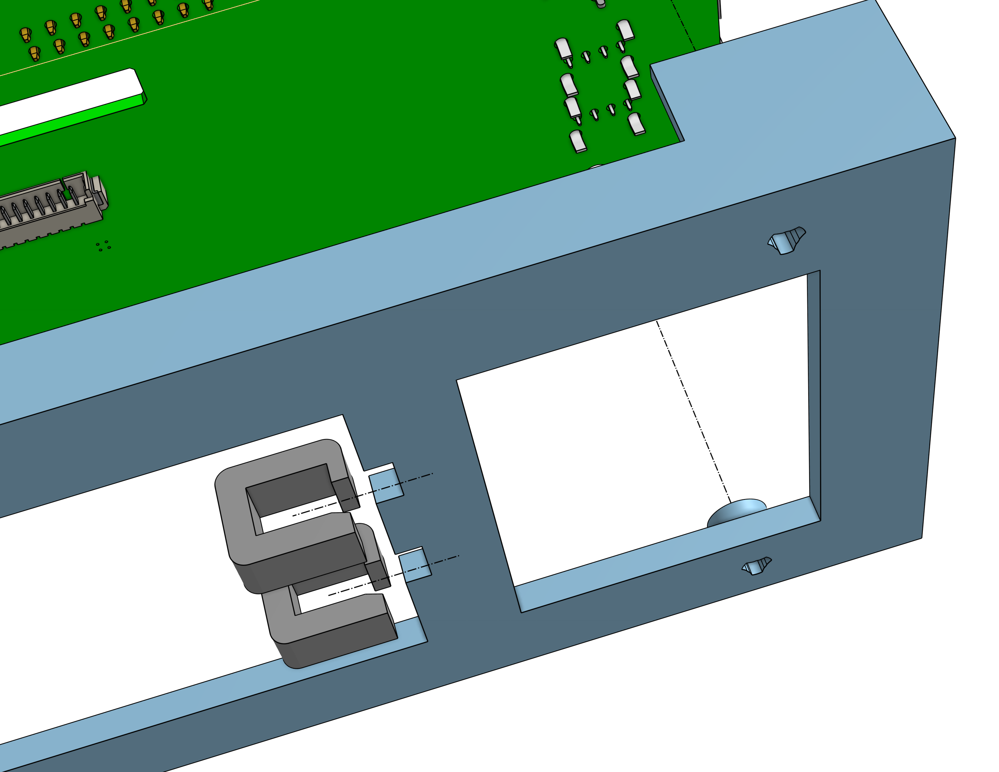
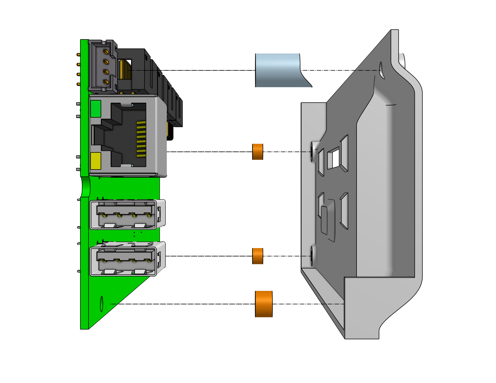

# Assembly instructions for X1Plus Expander

**Wow, you're here early!  Thanks for being one of the first backers!  At some
point, I'll update this with images of how to assemble Expander and its
case, or maybe even a video.  But for now, here is some text.**

## Assembling Expander with a SLS case

The easiest way to physically assemble X1Plus Expander, of course, is to
just buy a [case / mounting bracket from Crowd
Supply](https://www.crowdsupply.com/accelerated-tech/x1plus-expander)!  They're lovely SLS
nylon parts that are mostly dimensionally accurate, and even include a
locking tab that mates with the front of the printer.  The SLS case is
designed to work with the screw bundle that comes with the X1Plus Expander
package.

## Assembling Expander with an FDM case

If you did not buy an Expander from Crowd Supply, you can print a set of
plastics for Expander yourself.  To do this, download and print [the X1P-800](../x1p-800/FDM)
parts.  Some hints for how to print it:

  * You will need four copies of the clips, and three copies of the short standoff.  (Since the clips and standoffs are small, you might want to print some extras while you're at it.)

  * The lower shell can be more reliable to drive screws into if printed from PETG; the clips are also less prone to creep if printed from PETG. 

  * The upper shell is best printed standing on end.  It's OK to print it out of PLA if you want the matte cosmetic look rather than the gloss PETG look.

For reference, one print orientation that works for me is shown below.

Once printed, you will want to pre-assemble the case before attaching it to your printer:

  * Take the upper shell and the standoffs, and run the included M3 screws through them to ensure that they clear (it should be a clearance fit).

  * One of the standoffs is differently shaped; it mates with the curved face of the upper shell.  Line up all four standoffs in place on the upper shell, using the M3 screws to align them.  Use a dab of cyanoacrylate to hold them in place on the top case, so they don't run away when you try to assemble it.

  * Take the bottom case and attach the clips; they should snap in satisfyingly.  The open end of the clips should face left, since that's how it'll slide into the printer.  Once you're sure they attach correctly, use a dab of cyanoacrylate to attach them to the bottom case.  (This isn't entirely necessary, since the clips do have small hooks, but it can save you from some annoyance later when you're trying to juggle parts to assemble.)

  * Let the cyanoacrylate cure overnight to avoid frosting your board and/or printer.  If you prefer, instead of cyanoacrylate, you can use some heat to melt the plastic to bond the parts together -- the adhesive is only there to keep parts together during assembly.

See the exploded views before for more detail.

## Installing Expander into your printer

For those of you that bought an Expander case, the plastics that you
received are designed to work with the M3 screws that you received with
Expander, and you should not need to do any pre-assembly.

Once you have an Expander case ready to go, you're ready to install Expander into your printer!  To install it:

  * Power down and unplug your printer, of course.

  * Remove the LCD from your printer (remember that you have to press on the bottom of the hinge and slide right).  Disconnect the cable by pinching the sides.

  * Remove the AP board cover, and disconnect the power cable and camera cable from your AP board.  Connect the X1P-001 wiring harness to the AP board: the 4-pin cable labeled "CAM" plugs in where the camera previously connected, the 4-pin cable labeled "UART" plugs in to the other mating connector, and the harness's power cable plugs in where the power cable previously plugged in.

  * Plug the other mating connectors on the harness into the things that were previously connected: attach the camera to the X1P-001 wiring harness, and attach the power supply to the X1P-001 wiring harness.

  * Carefully route the wiring harness through the front of the printer, below the LCD cable.  Snap the AP board cover back in place.

  * Attach the lower shell to the front of the printer by pressing on the clips and sliding left.  If you have a SLS case, verify that the locking tab engaged.

  * Connect the wiring harness to the X1P-002 mainboard.  It is a tight fit: use your fingernails walking back and forth on either side of the cable until it is fully inserted.  It will only insert in one direction.

  * Feed the LCD cable through the hole in the X1P-002 mainboard, and the hole in the upper shell.

  * Line up the X1P-002 mainboard, the lower shell, and the upper shell.  Use the included M3 screws to attach it.  Tighten them incrementally in a circle.  Be gentle with the screws -- you are screwing a relatively small thread into plastic self-tapping holes, and it is easy to strip the plastic if you "go bananas" with the screw torque!

  * Attach the LCD cable to the display.  Attach the display to the front of the upper shell; it should make a satisfying "Snap!" when it locks into place.

  * Power up your printer.  (Glowing red LEDs on the mainboard are expected, and indicate correct power supply operation.)  Ensure that the printer's built in camera still works, then proceed to installing software!
