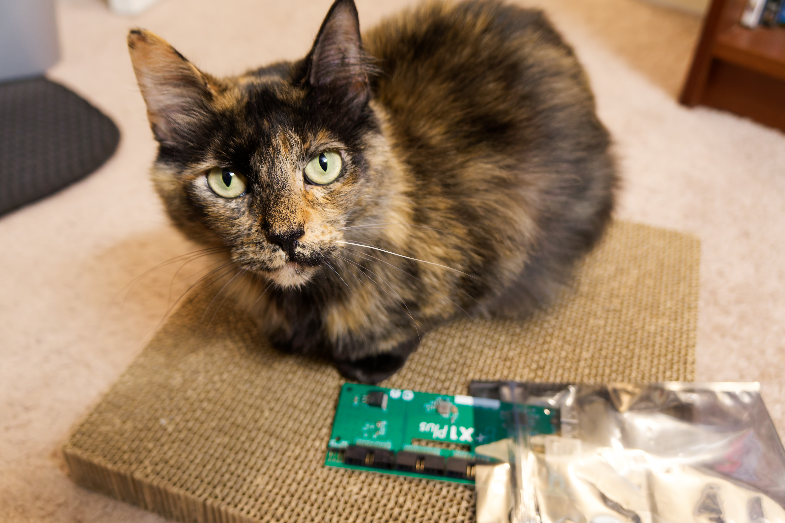

# Getting started with X1Plus Expander

Hi!  Thank you for buying [X1Plus
Expander](https://www.crowdsupply.com/accelerated-tech/x1plus-expander)!  It
has been quite a fun project to make this for you, and I'm glad that it's in
your hands.  This document will describe how to install Expander into your
printer, and will provide you with information on how to operate it.

## Getting Expander

X1Plus Expander is the hardware companion to the X1Plus open-source custom
firmware distribution for Bambu Lab’s X1 3D printers.  It extends your
printer’s functionality with an Ethernet port, two USB ports, a
STEMMA-compatible I²C connector, and four interchangeable GPIO headers for
expansion modules.

If you've come to this page and you *don't* own an X1Plus Expander, then you
should [buy one from Crowd
Supply](https://www.crowdsupply.com/accelerated-tech/x1plus-expander)! 

## Unpacking Expander

Your X1Plus Expander should have come in a brightly colored box labeled
"X1P-100".  Inside the box, there should be:

* One X1P-002 Expander mainboard.
* One X1P-001 wiring harness.
* A small baggie with three M3x12 screws, and one M3x18 screw.
* A ping-pong ball with a picture of Peanut, the cat, on it.
* A sheet with Instructions for Safe Use (or Sicherheitshinweise, if you
  prefer to read them in German).

Make sure that you have everything, and take a moment to read the
Instructions for Safe Use, and ensure that you understand them.  (You can
also read them [right here](instructions-for-safe-use.md), if you prefer.)

If you purchased other accessories, they will be packaged and labeled separately.

## Getting help with Expander

X1Plus Expander is not affiliated with, supported by, or endorsed by Bambu
Lab.  Accelerated Tech and X1Plus do not have any relationship with Bambu
Lab, and, in fact, they mostly just grudgingly put up with us.

That means that if something goes wrong with your printer, and you have
Expander installed, you have to remove it and uninstall X1Plus before you
can get support from Bambu Lab!

If you need help with Expander itself, you should first try the [Bambu
Unofficial Discord](https://discord.gg/4SfCufp6SB).  You can also send us an
e-mail through the [Crowd Supply contact
form](https://www.crowdsupply.com/accelerated-tech/x1plus-expander/ask-question).

## Installing Expander into your printer

Once you have unpacked X1Plus Expander, you'll need to assemble the hardware
and physically connect it to your printer.  [Read through the assembly guide
in its entirety](assembly.md), and after that, you can start connecting
wires to your printer.

Then, once you have Expander installed in your printer, you can [install the
appropriate software on your printer](software.md).  The software guide
[also discusses how to configure Expander](software.md).

## Other resources

[This repository](https://github.com/jwise/x1-expander) also contains the
full source code for the X1Plus Expander firmware, and CAD files if you
would like to make your own plug-in modules.  It also contains the
manufacturing software associated with the FATP process for Expander.  All
of the plastics designed for this project [were made with Onshape, and are
publicly available as
well](https://cad.onshape.com/documents/978d60c454bcccf39dac29ae/w/00e32d7fbc9730699d7762b9/e/c5ed48786c10ad210482490c).

Happy printing!

## Thanks to

Many people helped in the making of X1Plus Expander.  Here is a short list,
in no particular order, of people that I would like to credit.  I hope I did
not leave anyone out, but if I did, I hope also that you'll accept my
apologies...

* NixieBunny, who more than anything else, kept the idea of this
  project alive and made sure it happened.  He did some of the first
  schematics for Expander, and some of the early proto runs came out of his
  pocket; he reviewed many different versions of schematics and layouts,
  tested and reworked varying versions of the PCBs, and shipped them off to
  some of our early beta testers.  
* [Annie Ruygt](https://annieruygtillustration.com/) designed
  the unbelievable art for the X1P-100 box.  I gave her a vague idea of what
  I wanted, and she basically read my mind for the rest of it, and I'm so
  happy with what she came up with!
* DieterTheHorst, esden, and namibj, who helped with the German translation
  of the Instructions for Safe Use.
* The amazing team at Crowd Supply made it logistically possible for me to
  offer this kind of product to more people than just a handful of friends,
  and have graciously guided me through the process as a first-time creator.
* The "100% human created" icon on the box was designed by Thomas Knutsen. 
  [X1Plus Expander was created without the use of Generative Artificial
  Intelligence](https://no-ai-icon.com/statement/?url=https://github.com/jwise/x1-expander).
* Peanut was the executive supervisor for the X1Plus Expander project.
